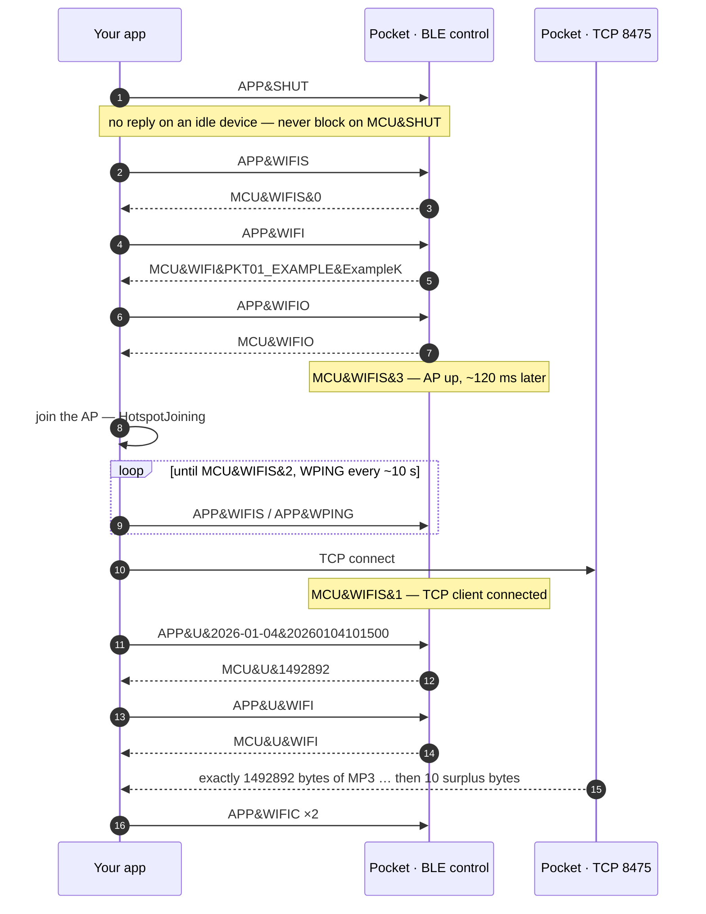

<p align="center">
  <picture>
    <source media="(prefers-color-scheme: dark)" srcset="docs/assets/enigma-labs-white.svg">
    
  </picture>
</p>

<h1 align="center">pocket-client</h1>

<p align="center">
  A Swift package that speaks your Pocket voice recorder's own BLE protocol —<br>
  discovery, authentication, inventory, download, record control, live audio.<br>
  No vendor app. No cloud. Your device, your bytes.
</p>

<p align="center">
  
  
  
  
  
</p>

<p align="center"><sub>An independent, reverse-engineered client by <b>Enigma Labs B.V.</b></sub></p>

---

## The wire

The protocol is plain ASCII, `&`-delimited, request/response, over three GATT
characteristics on one BLE link. Here is a whole working session — handshake,
status, inventory, download — exactly as it appears on the link:

```text
PKT01_EXAMPLE  ·  one BLE link  ·  service 001120a0

  →  APP&SK&ExampleKey000000             the handshake. Mandatory: every command
  ←  MCU&SK&OK                           sent before it is silently ignored.

  →  APP&BAT                             state: one round trip per field
  ←  MCU&BAT&100
  →  APP&SPACE
  ←  MCU&SPA&059632&059636               free MB & total MB

  →  APP&LIST_DIRS                       which days have recordings
  ←  MCU&DIRS&2026-01-04
  ←  MCU&DIRS_SUM&1                      the terminator carries the count
  →  APP&LIST&2026-01-04                 what is in that day
  ←  MCU&F&2026-01-04&20260104101500&4   date & timestamp & duration-seconds
  ←  MCU&LIST&1

  →  APP&U&2026-01-04&20260104101500     select it for upload
  ←  MCU&U&15302                         announced byte count — authoritative
  ⇐  FF F3 48 C4 …                       raw MP3 in 244-byte notifications
  ←  MCU&OFF                             end marker. A hint — the byte count is the truth.

  →  app writes 001120a2   ·   ←  device notifies 001120a3   ·   ⇐  bulk bytes on 001120a1
```

The same session, through this package:

```swift
import PocketClient

let transport = BLETransport()
_ = try await transport.connect()                    // scan, connect, resolve the 3 channels
let device = PocketDevice(transport: transport, sessionKey: "ExampleKey000000")
try await device.connect()                           // APP&SK&… → MCU&SK&OK

let status = try await device.status()
print("battery \(status.batteryPercent)%  ·  \(status.storage.freeMB) MB free")

for date in try await device.listDates() {                        // APP&LIST_DIRS
    for recording in try await device.listRecordings(on: date) {  // APP&LIST&<date>
        let mp3 = try await device.download(recording)            // APP&U&… → bytes → MCU&OFF
        try mp3.write(to: URL(fileURLWithPath: "\(recording.id.timestamp).mp3"))
        try await device.delete(recording.id)                     // APP&D&…
    }
}
await device.disconnect()
```

Recordings are raw MP3 elementary streams — MPEG-2 Layer III, 32 kbps, 16 kHz,
mono, sync header `FF F3 48 C4`. No container to strip; `ffmpeg`, `whisper`,
and `AVFoundation` all take them directly.

---

## Contents

- [Safety — read this first](#safety--read-this-first)
- [How claims in this document are graded](#how-claims-in-this-document-are-graded)
- [Sharp edges](#sharp-edges)
- [Requirements and installation](#requirements-and-installation)
- **The reference, in the order you will use it**
  - [1 · Discover a device](#1--discover-a-device)
  - [2 · Authenticate](#2--authenticate)
  - [3 · Read state](#3--read-state)
  - [4 · Read the inventory](#4--read-the-inventory)
  - [5 · Get the audio off it](#5--get-the-audio-off-it)
  - [6 · Control recording](#6--control-recording)
  - [7 · Listen live](#7--listen-live)
  - [8 · Watch for events](#8--watch-for-events)
  - [9 · Manage the binding](#9--manage-the-binding)
  - [10 · Run in the background on iOS](#10--run-in-the-background-on-ios)
  - [11 · Handle errors](#11--handle-errors)
  - [12 · Go below the session](#12--go-below-the-session)
- [`pocket-cli` — the hardware harness](#pocket-cli--the-hardware-harness)
- [Testing](#testing)
- [What this package is not sure about](#what-this-package-is-not-sure-about)
- [Protocol reference](#protocol-reference)
- [Disclaimer](#disclaimer)
- [License](#license)
- [Colophon](#colophon)

---

## Safety — read this first

> [!CAUTION]
> This package talks to a device that can be permanently destroyed by the wrong
> write. The safety properties below are not advice — they are enforced in the
> code, and they are the reason it is safe to run. **If you fork this, keep
> them.**

### Three services that must never be discovered or written

| Service | What it is | Why it is untouchable | Evidence |
|---|---|---|---|
| `ffd0` | Believed factory / test surface | Unidentified. Zero traffic in every capture; no reference anywhere in the vendor app. Writing unknown bytes to an unknown factory service is how devices die. | `inferred` |
| `e49a3001-f69a-11e8-8eb2-f2801f1b9fd1` | Wi-Fi/BLE combo-chip OTA receive | The Wi-Fi firmware contains a packetized BLE OTA receiver behind it. A partial or malformed image leaves the radio unbootable. | `inferred` |
| `e49a25f8-f69a-11e8-8eb2-f2801f1b9fd1` | Combo-chip provisioning / Wi-Fi config | Same chip, same failure mode; the vendor app's strings tie it to "WiFi OTA via BLE". | `inferred` |

**The MCU firmware is encrypted** (an `AOTA` container, entropy 8.0 — it cannot
be analysed offline), so a failed OTA cannot be diagnosed, undone, or reflashed
by anyone outside the vendor. **There is no recovery path. A bricked unit is
scrap.**

`BLETransport` therefore performs **explicit-UUID discovery**: it asks
CoreBluetooth only for the three `001120a*` characteristics it uses (command,
response, bulk data) and never enumerates the device's full GATT tree. The
three services above are not merely unwritten — they are never discovered.
Do not "just add" a general discovery call to see what is there. The same rule
holds on the iOS state-restoration path: a restored peripheral gets the same
explicit UUID lists, never a wildcard.

### Commands this package cannot express

These have **no `Command` case at all**, so no code path — including the `raw`
diagnostic verb, whose allowlist is a fixed lookup table of read-only probes —
can emit them. That is deliberate, and it is enforced by unit tests that assert
no generated wire frame ever contains these substrings.

| Command | What it does | Why it is forbidden |
|---|---|---|
| `APP&OTA&` (also `APP&OT&`, `APP&OT&OVER`) | MCU firmware update over BLE | Encrypted image, no recovery path — a failed flash bricks the recorder. |
| `APP&WOTA` | Wi-Fi chip OTA | Bricks the Wi-Fi radio; the device's fast-transfer path dies with it. |
| `APP&OTA&WIFI&` | Wi-Fi chip OTA over BLE | Same, and gated on firmware versions we cannot verify ("requires MCU T22+ and WiFi V10+"). |
| `APP&WIFI&CH&<ssid>&<psk>` | Provisions the device onto a Wi-Fi network | Reconfigures the radio out from under the transfer protocol. **Do not confuse it with the bare `APP&WIFI`**, which is a read-only credentials query and is safe — the forbidden command is the same verb with arguments appended. `Command.wifiCredentials` is argument-less by construction for exactly this reason. |

### `pocket-cli reset --wipe-all-recordings` destroys data

> [!WARNING]
> This is the one destructive operation the CLI can perform, and the flag name
> is the whole warning. It sends `APP&BLE&RESET`, which **permanently erases
> every recording on the device.** Not a soft delete, not a recycle bin — the
> storage is cleared, there is no undo, and there is no way to recover a
> recording that was not already downloaded. **Sync everything you care about
> first, and verify the copies, before you run it.** It also clears the
> device's binding, leaving it unbound.

It requires the current session key in `POCKET_SK` *and* the explicit flag
*and* a typed confirmation naming the device (`WIPE PKT01_EXAMPLE`); it refuses
without the flag and touches nothing. `APP&BLE&RESET` is deliberately not
expressible as a `Command`, so nothing else in this package — and nothing in the
library that links it — can reach it. The frame's bytes exist at exactly one
call site, in the CLI, behind that opt-in.

### Rebinding is verified, but reversible only through the vendor's app

After a reset the device trusts the next key it is offered: `pocket-cli adopt`
sends `APP&SK&<16 chars>` and it sticks across reconnects. This is
**verified on hardware**, and `adopt` proves it rather than assuming it — it
reconnects, re-authenticates, and confirms `APP&WIFI` now returns the new key's
first 8 characters, which is the only readable part of a key.

> [!IMPORTANT]
> **The new key is the only copy.** The device never reveals more than its
> first 8 characters, so a key you lose is a device you can no longer talk to
> through this package. Store it before you continue.

**Undoing a rebind is not something this package can do.** Re-adoption runs
through the vendor app's "unregistered-device recovery" path, which uses a
Remote-Config fallback master key and needs the *original account's* app
running near the device with that flag enabled. If you no longer have that app,
that account, or that flag, you may not get the device back onto the vendor's
ecosystem. (The consequence is reassuring in one direction: because recovery
needs the original account, a stranger's phone cannot quietly take an adopted
device.)

---

## How claims in this document are graded

Most READMEs oversell. The protocol reference
([`docs/protocol/ble-protocol.md`](docs/protocol/ble-protocol.md)) grades every
claim it makes by how it was established, and this document holds itself to the
same standard. Every capability below carries one of four tags:

| Tag | Meaning |
|---|---|
| `hardware` | Observed working against a real device — replayed from vendor-app btsnoop captures and confirmed by live probing, or run end to end by hand. |
| `probed` | Settled by sending the frame and reading the answer. Includes **negative** results: "the firmware says `MCU&UNKNOWN`" is a result. |
| `compile-only` | Compiles, and is unit-tested wherever the logic is pure — but the code path has never executed against real hardware or a real phone. |
| `inferred` | Reasoned from firmware strings, the vendor app's string tables, and the absence of traffic in every capture. Not proven. Treated as a reason for caution, never as a licence to act. |

> [!NOTE]
> **The sample size is one.** Every `hardware` claim rests on a single physical
> device running firmware 1.7 with Wi-Fi firmware V9. Behaviour on other
> colours, hardware revisions, or firmware versions is unknown, and a firmware
> update can invalidate any of it. Run `pocket-cli probe` and
> `pocket-cli probe-unverified` against your own hardware before trusting this
> with anything you cannot lose.

Tags describe *device and protocol* behaviour. Platform obligations (Info.plist
keys, entitlements, Keychain accessibility) are Apple's documented contract, not
claims about this recorder, and carry no tag.

---

## Sharp edges

The things that cost someone a day. Each is documented where it lives; this is
the index.

| Edge | What actually happens | Where |
|---|---|---|
| `APP&STA` **starts** a recording | It is one letter from `APP&STE`, which *queries*. `Command` keeps them as distinct cases so a method can never drift onto the wrong string. | [6 · Control recording](#6--control-recording) |
| No unsolicited stop event | Stopping on the device sends **nothing**. `MCU&STO` exists only as the reply to a remote `APP&STO`. To notice a stop you must poll `isRecording()`. | [8 · Watch for events](#8--watch-for-events) |
| `MCU&RT` is one-shot | It fires once at connect when a recording is already running, and **never repeats**. Nothing on the wire advances elapsed time; any UI clock must run locally from that anchor. | [8 · Watch for events](#8--watch-for-events) |
| Ten bytes past the end | A Wi-Fi transfer's TCP stream carries a short trailer (10 bytes observed) past the announced length. The announced count is authoritative; drain-to-EOF overshoots and fails an exact-length check. | [5 · Get the audio off it](#5--get-the-audio-off-it) |
| `APP&SHUT` may never answer | On an idle device there is **no** `MCU&SHUT`. Blocking on the reply hangs the happy path. | [12 · Go below the session](#12--go-below-the-session) |
| `APP&U&WIFI` is a modifier | It reroutes the upload already selected by `APP&U&<date>&<ts>` to the TCP socket. Sent alone it has nothing to reroute. | [5 · Get the audio off it](#5--get-the-audio-off-it) |
| `WiFiState` counts *down* | The progression is `0` off → `3` AP up → `2` client associated → `1` TCP connected. The numbers are not a sequence. | [5 · Get the audio off it](#5--get-the-audio-off-it) |
| There is no resume | `APP&U&<date>&<ts>` takes no byte offset, and no other command does either. A transfer that dies at 99% restarts from byte zero. | [5 · Get the audio off it](#5--get-the-audio-off-it) |
| One request at a time | A second concurrent request fails fast with `PocketError.busy`. The package serialises nothing for you. | [2 · Authenticate](#2--authenticate) |
| Single-use lifecycle | A `BLETransport` + `PocketDevice` pair serves exactly one connection. To reconnect, build both again. | [2 · Authenticate](#2--authenticate) |
| Single-consumer streams | `events`, `liveAudio()`, and the transport's two streams each expect exactly one iterator. A second `for await` splits the elements nondeterministically. | [8 · Watch for events](#8--watch-for-events) |
| Recording IDs are not all dates | Real devices produce IDs like `PH260105143000`. `RecordingID.date` then carries the raw ID verbatim rather than a fabricated `YYYY-MM-DD`. | [4 · Read the inventory](#4--read-the-inventory) |
| Zero-length recordings exist | A 0-second recording announces 0 bytes and fails fast with `PocketError.emptyRecording` — deliberately with no BLE fallback. | [5 · Get the audio off it](#5--get-the-audio-off-it) |
| A wrong key drops the link | `MCU&SK&ERR` is followed by the device closing the connection, not by a retry prompt. | [2 · Authenticate](#2--authenticate) |
| `MCU&OFF` is a hint | Completion is byte-count driven. The response and data channels have no cross-channel ordering guarantee. | [5 · Get the audio off it](#5--get-the-audio-off-it) |

---

## Requirements and installation

- **iOS 17+, macOS 14+.** Swift 6 toolchain (`swift-tools-version: 6.0`, sources
  compiled in language mode 5).
- **No third-party dependencies.** The package links Apple frameworks only:
  `CoreBluetooth`, `Network`, `Security` (for the optional Keychain store), and
  `NetworkExtension` on iOS (for the programmatic hotspot join).

```swift
// Package.swift
dependencies: [
    .package(url: "https://github.com/kernelalex/pocket-client.git", from: "0.1.0"),
],
targets: [
    .target(name: "YourApp", dependencies: [
        .product(name: "PocketClient", package: "pocket-client"),
    ]),
]
```

In Xcode: **File → Add Package Dependencies**, then paste
`https://github.com/kernelalex/pocket-client.git`.

> [!NOTE]
> **The version is `0.x` on purpose.** Under semver, `1.0.0` is a promise of API
> stability. Every verified claim in this document rests on one device running
> one firmware version, and a firmware update can invalidate any of them — so
> the API may still have to change to match what the hardware turns out to do.
> `0.x` says that in the language dependency resolvers understand. Pin with
> `from:` and read the release notes before upgrading.

The package vends two products: the `PocketClient` library and the
`pocket-cli` executable (macOS hardware harness).

App-side obligations on iOS:

| Need | Key / entitlement |
|---|---|
| Any Bluetooth use | `NSBluetoothAlwaysUsageDescription` in Info.plist |
| Programmatic Wi-Fi join for `.wifi` downloads | Hotspot Configuration entitlement |
| Background relaunch for BLE events | `bluetooth-central` in `UIBackgroundModes` |

---

## 1 · Discover a device

**Evidence:** `hardware` for the scan and both connect paths; `compile-only`
for the state-restoration branch — see
[10 · Run in the background on iOS](#10--run-in-the-background-on-ios).

`BLETransport.connect()` takes whichever `PKT01_*` advertiser answers first —
fine with one Pocket, wrong with two in range. A pairing flow therefore gets two
separate primitives: **enumeration without connecting**, and **connecting to a
chosen identifier**. The session key cannot substitute for the choice: it is an
account credential shared across a user's devices, so it says nothing about
*which* physical Pocket is intended.

### `PocketScanner` — the picker feed

Strictly link-layer. It reads advertisements, never connects, sends no commands,
and touches no GATT table at all.

```swift
let scanner = PocketScanner()                      // or PocketScanner(namePrefix:ageOut:)

for await state in scanner.updates() {
    switch state {
    case .scanning(let nearby):
        for pocket in nearby {
            print(pocket.name, pocket.identifier, pocket.rssi ?? -1)
        }
    case .poweredOff:   print("Turn on Bluetooth")
    case .unauthorized: print("Allow Bluetooth access in Settings")
    case .unsupported:  print("This device has no Bluetooth LE")
    case .starting:     break     // radio state not known yet
    }
}
```

`PocketScanner.State` keeps the three unavailability reasons distinct on
purpose: "turn Bluetooth on", "allow the app to use Bluetooth", and "this device
cannot do BLE" need different words, and a UI cannot invent that distinction
itself.

Each row is a `NearbyPocket`:

```swift
public struct NearbyPocket: Sendable, Equatable, Identifiable {
    public let identifier: UUID   // what BLETransport.connect(to:) takes
    public let name: String       // PKT01_<COLOUR>_<mac-suffix>
    public let rssi: Int?         // dBm; nil until a usable reading arrives
    public var id: UUID { identifier }
    public init(identifier: UUID, name: String, rssi: Int?)
}
```

Scan-list behaviour — all of it pinned by unit tests on the pure policy type:

- Rows are keyed by peripheral identifier: a repeated advertisement refreshes
  the row rather than duplicating it, and shows the **latest** RSSI.
  CoreBluetooth's `127` "unavailable" sentinel never blanks a real reading.
- Ordering is **first-seen and never reshuffles** — that *is* the damping
  policy. RSSI jitters by tens of dB between advertisements; sorting by it would
  reorder the list under the user's thumb exactly as they reach for a row. New
  devices append, silent devices vanish, nothing else ever moves. Signal
  strength is row data, not a sort key.
- A device silent for **10 s** ages out; if it reappears it re-joins at the end
  like a new arrival. The window is injectable
  (`PocketScanner(namePrefix:ageOut:)`) because the default is a judgment call
  pending real advertisement-cadence measurements — `inferred`, not measured.
- The radio scans only while at least one `updates()` consumer is alive. Ending
  the loop, or cancelling its task, stops the scan. A scanner left running is a
  battery bug, so consumption is the on-switch.
- The scanner is **restartable** (unlike `BLETransport`): calling `updates()`
  again after the last consumer went away scans afresh, and every session starts
  with an empty list.
- It owns its own central manager, created on the **first `updates()` call** —
  which is what triggers the OS Bluetooth permission prompt, so a
  merely-instantiated scanner is inert. Being separate from any `BLETransport`'s
  central means enumeration can never leave a transport in a state that breaks a
  later connect.
- Live RSSI relies on duplicate advertisement deliveries, which iOS provides in
  the **foreground only** — exactly where a pairing picker lives. Do not expect
  the list to stay live in the background.

### `BLETransport.connect()` — first matching advertiser

```swift
let transport = BLETransport()                    // BLETransport(namePrefix:restoreIdentifier:)
let found: DiscoveredDevice = try await transport.connect()          // default timeout 20 s
let alsoFound = try await transport.connect(timeout: .seconds(45))   // the whole sequence
print(found.name, found.identifier)
```

`connect()` covers the whole sequence under one timeout: wait for the radio,
scan, connect, and resolve the three channel characteristics. It returns a
`DiscoveredDevice` (`name`, `identifier`) — a value the package constructs; it
has no public initialiser.

### `BLETransport.connect(to:)` — one specific Pocket

```swift
// The user tapped a row: end the updates() loop (that stops the radio), then
let transport = BLETransport()
let found = try await transport.connect(to: chosenIdentifier)   // no scan, no fallback
```

`connect(to:)` resolves the identifier via `retrievePeripherals` — it never
scans. An identifier this system has never seen fails **immediately** with
`PocketError.deviceNotFound(_:)`; one the system knows but cannot reach (device
asleep, out of range, or factory-reset into a new BLE identity) fails when the
timeout expires. There is deliberately **no fallback to "some other Pocket"** —
that would defeat the point of choosing one. Everything past resolution is the
scanned path: the same explicit-UUID discovery, the same resolved link.

### Link diagnostics

Two read-only accessors, added for the hardware harness. They report state that
discovery already produced and perform no BLE operation of any kind.

```swift
await transport.commandCharacteristicProperties()  // "write-with-response, notify", or nil
await transport.notifyStateSummary()               // "response: enabled, bulk: enabled"
```

A handshake timeout plus `"no callback yet"` in the notify summary points at the
CCCD enable, not at authentication. That distinction is why these exist.

> [!NOTE]
> `BLETransport` and `PocketScanner` also expose `centralManager(_:…)` and
> `centralManagerDidUpdateState(_:)` publicly. Those are `CBCentralManagerDelegate`
> and `CBPeripheralDelegate` requirements — Swift forces protocol witnesses to be
> at least as visible as the conforming type. They are not API: never call them,
> and never install these objects as another central's delegate. Every other
> public symbol in the package is documented below.

---

## 2 · Authenticate

**Evidence:** `hardware`.

The session-key handshake is **mandatory**: commands sent before it are silently
ignored by the device, which is a far worse failure than a rejection. A wrong
key answers `MCU&SK&ERR` **and then the device drops the link** — expect a
disconnect, not a retry prompt.

```swift
let device = PocketDevice(transport: transport, sessionKey: "ExampleKey000000")
try await device.connect()      // APP&SK&… → MCU&SK&OK
// … work …
await device.disconnect()       // idempotent
```

`PocketDevice` is an actor and the package's front door:

```swift
public actor PocketDevice {
    public init(transport: PocketTransport,
                sessionKey: String,
                joiner: HotspotJoining = SystemHotspotJoiner())
    public nonisolated var events: AsyncStream<DeviceEvent> { get }
    public func connect() async throws
    public func disconnect() async
}
```

The `joiner` performs the Wi-Fi hotspot join for `.wifi` and `.auto` downloads.
The default joins programmatically on iOS; on macOS pass `ManualHotspotJoiner()`
(see [5 · Get the audio off it](#5--get-the-audio-off-it)).

**The session key** is, on a factory device, the first 16 characters of the
account's Firebase UID. It is also the root of the Wi-Fi AP password (its first
8 characters), so treat it as a device credential. This package never stores it;
the caller supplies it per instance. If you want persistence, opt in to
[`SessionKeyStore`](#sessionkeystore--opt-in-keychain-persistence).

### Lifecycle is single-use

A `BLETransport` + `PocketDevice` pair serves **one** connection. After
`disconnect()` — or a failed `connect()`, which also tears the session down —
the pair is spent:

| Call | State | Result |
|---|---|---|
| `connect()` | fresh | performs the handshake |
| `connect()` | connect in flight | `PocketError.busy("connect already in progress")` |
| `connect()` | already connected | `PocketError.busy("already connected")` |
| `connect()` | spent (disconnected, or a failed connect) | `PocketError.disconnected` |
| `disconnect()` | any | succeeds; idempotent |

To reconnect, construct a fresh `BLETransport` **and** a fresh `PocketDevice`.
This is not a limitation being apologised for: `disconnect()` permanently
finishes the transport's single-consumer streams, which is exactly what lets the
session's consume loops terminate. Reconnection through the same instance could
never work, so it is rejected loudly instead of failing subtly.

### One request at a time

The session allows a single in-flight request. A second concurrent request from
another task fails fast with `PocketError.busy` rather than queueing. **An app
must funnel all device access through one task or queue — the package serialises
nothing for you.** Downloads and live audio additionally claim an exclusive
*transfer* slot for their whole duration; the second concurrent caller gets
`.busy` there too.

A 30-second `APP&BAT` keepalive runs for the life of the session. It never arms
a waiter, so it cannot race a user request into the busy guard, and the session
absorbs exactly one `MCU&BAT` echo per ping so its own link filler never shows
up as an anomaly.

---

## 3 · Read state

**Evidence:** `hardware` for every field.

```swift
let status: DeviceStatus = try await device.status()

status.batteryPercent   // 100          ← APP&BAT
status.firmware         // "1.7"        ← APP&FW
status.macAddress       // "00005e005300" ← APP&MAC
status.wifiFirmware     // "V9"         ← APP&WF
status.storage.freeMB   // 59632        ← APP&SPACE
status.storage.totalMB  // 59636
status.slider           // .conversation ← APP&REC&SECEN
status.isRecording      // false        ← APP&STE
```

`status()` is **seven round trips**, one per field — there is no combined status
frame in the protocol. When all you need is the recording flag, use the narrow
query instead:

```swift
let recording = try await device.isRecording()   // one APP&STE round trip
```

`isRecording()` exists to be polled cheaply. It is the **only** way to learn
that a recording stopped, because a device-button stop sends nothing
unsolicited.

`SliderPosition` reports the physical switch:

```swift
public enum SliderPosition: Sendable, Equatable {
    case conversation   // MCU&REC&CON — slider down
    case call           // MCU&REC&CALL — slider up
}
```

The slider emits **no BLE events on movement** (it is a hardware mic multiplexer),
so its position is only ever readable by asking.

Setting the clock takes UTC and is formatted for you:

```swift
try await device.setClock()             // now
try await device.setClock(someDate)     // APP&T&YYYYMMDDHHMMSS, always UTC
```

---

## 4 · Read the inventory

**Evidence:** `hardware`.

Recordings live in date directories. Listing is two levels, and each level is a
stream of entries terminated by a summary frame carrying the count.

```swift
let dates: [String] = try await device.listDates()               // APP&LIST_DIRS
for date in dates {
    let recordings: [RecordingInfo] = try await device.listRecordings(on: date)
    for recording in recordings {
        print(recording.id.timestamp,
              recording.durationSeconds,
              recording.estimatedBytes)                          // duration × 4000
    }
}
```

```swift
public struct RecordingID: Sendable, Hashable, Codable {
    public let date: String        // usually YYYY-MM-DD
    public let timestamp: String   // usually YYYYMMDDHHMMSS
    public init(date: String, timestamp: String)
}

public struct RecordingInfo: Sendable, Equatable {
    public let id: RecordingID
    public let durationSeconds: Int
    public var estimatedBytes: Int { durationSeconds * 4000 }   // fixed 32 kbps
    public init(id: RecordingID, durationSeconds: Int)
}
```

> [!IMPORTANT]
> **Recording IDs are not always 14-digit timestamps.** Real devices also
> produce IDs like `PH260105143000` — probably phone-call recordings, though
> the package does not bet on that. For any ID that is not exactly 14 ASCII
> digits, `RecordingID.date` carries the **raw ID verbatim** instead of a
> fabricated `YYYY-MM-DD`. Do not assume either field's shape. Slicing a
> "date" out of such an ID would silently aim later `APP&U` / `APP&D` commands
> at a directory that does not exist; deriving one from the wall clock would
> guess wrongly around midnight. The true directory for any recording always
> comes from `listDates()` / `listRecordings(on:)`.

Deleting is a single round trip and is verified by the file disappearing from
the next listing:

```swift
try await device.delete(recording.id)      // APP&D&<date>&<ts> → MCU&D
```

---

## 5 · Get the audio off it

**Evidence:** `hardware` — both transports verified **byte-identical** to a
reference capture of the same recording.

### Into memory

```swift
let mp3: Data = try await device.download(recording)             // .auto
let overBLE = try await device.download(recording, via: .ble)
let withProgress = try await device.download(recording, via: .auto) { fraction in
    print("\(Int(fraction * 100))%")
}
```

Convenient at the device's observed sizes (≤ ~7 MB).

### Streaming to disk

```swift
let out = URL(fileURLWithPath: "\(recording.id.timestamp).mp3")
try await device.download(recording, to: out, via: .auto) { fraction in
    print("\(Int(fraction * 100))%")
}
```

Same routing, same progress, same integrity rules — exact announced byte count,
`FF F3` MP3 sync checked on the first bytes as they stream — without ever
holding the whole recording in memory. Use it for backlog syncs and long
recordings.

The bytes stream into a hidden `.<name>.partial-<uuid>` companion **in the
destination's own directory** (same volume, so the final move is an atomic
rename) and are renamed into place only after validation passes. On **any**
failure — truncation, bad payload, cancellation, a full disk — nothing appears
at the destination, and a pre-existing file there is never damaged by a failed
re-download.

> [!IMPORTANT]
> **There is no resume.** `APP&U&<date>&<ts>` is the only download command and
> takes no byte offset or range — nor does any other command in the protocol,
> including the ones recovered from the vendor APK's string table. A transfer
> that fails at 99% restarts from byte zero **by protocol constraint, not
> client choice**. Streaming saves memory, not re-transfer time. Do not expect
> a resume API unless a future firmware adds an offset command.

### Choosing a transport

```swift
public enum TransferMode: Sendable, Equatable {
    case ble
    case wifi
    case auto   // WiFi above ~1 MB estimated, else BLE; falls back to BLE on WiFi failure
}
```

| Mode | Measured throughput | Notes | Evidence |
|---|---|---|---|
| `.ble` | ~35 KB/s | Always available. 244-byte notifications on `001120a1`. | `hardware` |
| `.wifi` | ~36 KB/s on a small (~200 KB) file; the vendor capture moved 1.49 MB in 2.13 s (~700 KB/s) | The advantage grows with file size — AP setup and join dominate small transfers. Requires joining the recorder's AP. | `hardware` |
| `.auto` | — | Estimates size from duration at the fixed 32 kbps (`durationSeconds × 4000`), picks Wi-Fi above 1 MB (≈ 4.4 minutes of audio), else BLE. | `hardware` |

`.auto` must decide **before** the size is announced, which is why it estimates
rather than asks. Its fallback is narrow on purpose: a failed Wi-Fi attempt
degrades to BLE, but **not** for caller cancellation (you get `CancellationError`)
and **not** for `PocketError.emptyRecording` (a BLE retry would fail identically,
only slower). An explicit `.wifi` never falls back — it surfaces the failure.

Downloads and live audio are mutually exclusive: the device has one transfer
engine, and the second concurrent caller gets `PocketError.busy`.

### The Wi-Fi handoff

**Evidence:** `hardware` for the whole sequence (decoded frame by frame from an
HCI snoop of one complete vendor-app sync, TCP side from a simultaneous packet
capture); `compile-only` for the iOS programmatic join.

Control stays on **BLE for the entire flow**; only file bytes travel over TCP.
The device serves `192.168.200.1:8475` on its own access point — SSID is the BLE
name, WPA2 password is the session key's first 8 characters.



Three things in that flow bite:

1. **`APP&WIFIO` is what starts the AP.** Querying credentials does not. A
   `WIFIS` poll between the credentials query and `WIFIO` still returns `0`.
2. **`APP&U&WIFI` is a modifier, not a request.** It reroutes the upload
   already selected by the preceding `APP&U&<date>&<ts>` onto the socket and
   names no recording itself. Sent alone it has nothing to reroute. During the
   selection the device may briefly restart BLE bulk (~15 KB of leakage in the
   capture); no bulk sink is installed on this path, so those notifications are
   discarded and never mixed into the file.
3. **The device sends more bytes than it announced.** Ten surplus bytes were
   observed past the announced length on live hardware — `BA 5A 02 8F 04`
   repeated twice, meaning unidentified (`inferred`, one sample). The announced
   count is authoritative: a BLE download of the same recording is byte-identical
   at exactly that length. Read exactly the announced bytes and ignore the rest.
   A client that drains to EOF overshoots and fails an exact-length check —
   which is precisely how the trailer was discovered. This package surfaces the
   surplus as `DeviceEvent.wifiTrailerReceived(byteCount:preview:)` and never
   lets it reach the file.

The Wi-Fi state machine is worth reading twice, because the numbers do not
ascend with progress:

```swift
public enum WiFiState: Int, Sendable, Equatable {
    case off            = 0
    case tcpConnected   = 1
    case clientJoined   = 2
    case accessPointUp  = 3
}
// progression: 0 → 3 → 2 → 1
```

State `1` means the TCP client is connected on `:8475`. It is reported **before**
any upload command, so it does not mean "transferring".

### Who joins the access point

```swift
public protocol HotspotJoining: Sendable {
    func join(ssid: String, passphrase: String) async throws
    func leave() async
}
```

| Implementation | Platform | Behaviour | Evidence |
|---|---|---|---|
| `SystemHotspotJoiner` (default) | iOS | Joins programmatically via `NEHotspotConfiguration` with `joinOnce = true`. Requires the Hotspot Configuration entitlement **in the consuming app**, not in this package. Treats `alreadyAssociated` as success, so a half-failed earlier attempt does not silently degrade `.auto` to BLE. On macOS it throws `PocketError.wifiJoinFailed` naming the SSID and password. | `compile-only` on iOS |
| `ManualHotspotJoiner` | macOS | Prints the SSID and password, blocks on `readLine()` until the operator joins in System Settings and presses return, then runs the transfer. Afterwards it says the operator may rejoin their normal network. | `hardware` |

```swift
// macOS harness
let device = PocketDevice(transport: transport,
                          sessionKey: "ExampleKey000000",
                          joiner: ManualHotspotJoiner())

// A custom joiner, e.g. one that drives your own UI
struct PromptingJoiner: HotspotJoining {
    func join(ssid: String, passphrase: String) async throws { /* show, await user */ }
    func leave() async { /* dismiss */ }
}
```

The AP is closed on **every** exit path, success or failure — a still-broadcasting
AP competes with BLE for the same 2.4 GHz radio, and a failed Wi-Fi attempt is
exactly when the BLE fallback needs that radio.

Timing is tunable through `WiFiReadiness`, which mirrors the vendor app's
measured cadence:

```swift
public struct WiFiReadiness: Sendable {
    public var timeout: Duration        // default .seconds(30) — bounds the association wait AND the TCP connect
    public var pollInterval: Duration   // default .seconds(1)  — APP&WIFIS poll rate
    public var pingInterval: Duration   // default .seconds(10) — APP&WPING keepalive rate
    public init(timeout: Duration = .seconds(30),
                pollInterval: Duration = .seconds(1),
                pingInterval: Duration = .seconds(10))
}
```

`WiFiReadiness` is a `PocketSession`-level knob; `PocketDevice.download` uses the
defaults. To tune it, drop to the session (see
[12 · Go below the session](#12--go-below-the-session)):

```swift
let data = try await session.downloadOverWiFi(
    recording,
    joiner: ManualHotspotJoiner(),
    readiness: WiFiReadiness(timeout: .seconds(60), pollInterval: .seconds(1), pingInterval: .seconds(8)))
```

The readiness wait is **lenient by design**: if the association is never
observed within the window, the transfer proceeds anyway and the fact is
surfaced as `DeviceEvent.wifiReadinessNotObserved` rather than raised as an
error. A firmware whose state machine differs from the capture should not be
blocked from a transfer that would have worked — but it should not do it
silently either.

### Empty recordings

```swift
do {
    _ = try await device.download(recording)
} catch PocketError.emptyRecording {
    // The device announced 0 bytes. 0-second recordings exist on real hardware.
}
```

Distinct from `.notMP3` on purpose: without the guard, an empty payload passes
the byte-count check (`0 == 0`) and dies in the sync-word check, telling you the
channel is corrupt when in fact the recording is empty.

---

## 6 · Control recording

**Evidence:** `hardware` for start and stop; `probed` (negative) for
pause and resume.

```swift
let id: RecordingID = try await device.startRecording()   // APP&STA → MCU&REC&CON + MCU&STA&<ts>
print(id.date, id.timestamp)                              // the file key for later download/delete

try await device.stopRecording()                          // APP&STO → MCU&STO
```

> [!WARNING]
> **`APP&STA` starts a recording. `APP&STE` queries one.** One letter apart, on
> a device that records people. `Command` keeps `.startRecording` and
> `.recordingState` as distinct cases precisely so a convenience method can
> never drift onto the wrong wire string, and `isRecording()` is the query.

**There is no `pauseRecording()` / `resumeRecording()`.** `APP&PAU` and
`APP&RESU` exist in the vendor app's string table but appear in no capture, and
when probed against firmware 1.7 on 2026-07-25 — with a recording in progress —
both answered `MCU&UNKNOWN`. Shipping methods that always throw would be worse
than omitting them; use `stopRecording()`. The `Command.pauseRecording` and
`Command.resumeRecording` cases remain **only** so `pocket-cli probe-unverified`
can re-test a future firmware. A `MCU&UNKNOWN` reply surfaces as
`PocketError.unknownCommand(_:)`.

---

## 7 · Listen live

**Evidence:** `hardware` — HCI snoop of a record-start session, MP3 syncs
confirmed mid-stream.

While a recording is active the device streams the audio in real time on the
same bulk channel that file transfers use.

```swift
let stream: AsyncStream<Data> = try await device.liveAudio()
var captured = Data()
for await chunk in stream {
    captured.append(chunk)          // MP3 frames, same framing as stored files
}
```

- It **throws**: the stream claims the exclusive transfer slot, so starting it
  during a download — or starting a download while it runs — fails with
  `PocketError.busy`. Before `connect()` it throws `PocketError.notAuthenticated`.
- Frames only flow while a recording is active. An empty stream usually means
  nothing is recording, not that the tap is broken.
- The stream buffers the newest **32 BLE chunks** (~2 s of audio at 32 kbps).
- On overflow it drops at **BLE-chunk granularity, not MP3-frame granularity**,
  so a drop splices the bitstream mid-frame: a decoder resyncs at the next frame
  header with an audible glitch rather than merely skipping old audio. Drops are
  **not observable by the consumer**.
- A lossless copy therefore comes from downloading the file after recording
  stops — not from this tap.
- The slot and the bulk sink are released when the stream terminates, from
  either side: the consumer's task being cancelled or the stream being dropped,
  or the session ending (`disconnect()`, link loss).

---

## 8 · Watch for events

**Evidence:** `hardware` for every device-originated case;
`DeviceEvent.wifiReadinessNotObserved` is a session-level diagnostic.

`device.events` carries unsolicited traffic and session diagnostics:

```swift
Task {
    for await event in device.events {
        switch event {
        case .recordingStarted(let id):
            print("started on-device:", id.timestamp)
        case .recordingInProgress(let since, let elapsedSeconds):
            print("already recording since \(since), \(elapsedSeconds)s in")
        case .recordingStopped:
            break                                    // see the warning below
        case .disconnected:
            print("link lost")
        case .unmatchedResponse(let frame):
            print("device said:", frame)             // verbatim
        case .wifiTrailerReceived(let byteCount, let preview):
            print("\(byteCount) surplus bytes:", preview as NSData)
        case .wifiReadinessNotObserved:
            print("no MCU&WIFIS&2 within the window — transferring anyway")
        }
    }
}
```

| Case | Fires when |
|---|---|
| `.recordingStarted(RecordingID)` | A recording started, from the device button or a remote `APP&STA`. |
| `.recordingInProgress(since:elapsedSeconds:)` | `MCU&RT` at connect time, when a recording is **already** running. |
| `.recordingStopped` | An `MCU&STO` reached the unsolicited path. **Not a stop signal** — see below. |
| `.disconnected` | Link loss. |
| `.unmatchedResponse(String)` | The device sent a frame that satisfied no armed request matcher and is not a known unsolicited event — carried verbatim, `.unparsed` frames included. |
| `.wifiTrailerReceived(byteCount:preview:)` | Surplus TCP bytes past a Wi-Fi transfer's announced length. `preview` is capped at 64 bytes. |
| `.wifiReadinessNotObserved` | A Wi-Fi transfer proceeded without the device reporting a joined client. Diagnostic, not an error. |

> [!WARNING]
> **There is no unsolicited stop event, and `MCU&RT` is not a tick.**
>
> Stopping a recording on the device sends **nothing at all** (field-confirmed
> 2026-07-26). `MCU&STO` exists only as the reply to a remote `APP&STO`, so
> `.recordingStopped` fires only when that reply misses its waiter — for
> example when it lands after the request timed out. A client that needs to
> notice stops must **poll `isRecording()`**.
>
> `MCU&RT&<start_ts>&<elapsed_secs>` fires **once, at connect**, and never
> repeats. Nothing on the wire advances a recording's elapsed time. Any UI
> clock must run locally, anchored to that value. An app that rendered the last
> reported number showed a frozen `RECORDING 00:00` for an entire session —
> that is the failure mode this note exists to prevent.

`.unmatchedResponse` is the difference between "the device answered in a shape
we did not expect" and "the device never answered" — a distinction that hid the
real Wi-Fi handshake during development. It is observation only: yielding it
never changes matching or timeouts. The one thing the session absorbs is the
`MCU&BAT` echo of its own 30-second keepalive, one per ping. Every other frame
surfaces.

Stream discipline:

- **Single-consumer.** One shared `AsyncStream` backs the property, so a second
  concurrent `for await` splits events between the iterators nondeterministically.
  Hand it to exactly one consumer and fan out from there.
- **Buffers the newest 64 events**, dropping the oldest — which can never drop
  the final `.disconnected`, because it is the last thing yielded.
- **It always finishes**, on link loss or `disconnect()`, so an event loop
  terminates instead of blocking on a dead session.
- On **link loss** the final `.disconnected` is guaranteed to be delivered
  before the stream ends. After an explicit `disconnect()` the stream may finish
  without it — the caller already knows — so **treat stream termination, not the
  event, as the end signal.**

---

## 9 · Manage the binding

**Evidence:** `hardware` for key generation, adoption, and the reset;
`compile-only` for the Keychain store on iOS (its macOS behaviour is
`hardware`-observed in the negative: unsigned test runners get
`errSecMissingEntitlement`).

### `PocketKey` — mint your own session key

The vendor's UID is only *a* key, not a required one. The firmware validates
`APP&SK&` on **length alone** — 16 characters, no charset check — so a random
16-character string is a legal key.

```swift
let key = PocketKey.generate()          // 16 chars, uniform over [A-Za-z0-9]
PocketKey.isValid(key)                  // true
PocketKey.isValid("ExampleKey000000")   // true
PocketKey.isValid("short")              // false
PocketKey.length                        // 16
PocketKey.alphabet.count                // 62
```

The alphabet is 62 symbols — uppercase, lowercase, digits — and stops there
deliberately. Every key the firmware has ever been given is a Firebase-UID
prefix, which is alphanumeric; its handling of anything outside that alphabet is
**unknown**, and `&` in particular is the protocol delimiter and would corrupt
the frame. `isValid` exists so an operator-supplied key is vetted *before* it
reaches the device: the firmware would accept a wrong-length or exotic key on
length alone, or mis-parse it.

Keys are drawn from `SystemRandomNumberGenerator` (a CSPRNG on Apple platforms)
via `randomElement(using:)`, whose rejection sampling makes the draw uniform
with **no modulo bias**. The key is the device credential and the seed of its
Wi-Fi AP password; weak randomness here would weaken both. The space is
62¹⁶ ≈ 4.7 × 10²⁸.

Binding a key to a device is a CLI operation, not a library one — see
[`pocket-cli adopt`](#pocket-cli--the-hardware-harness).

### `SessionKeyStore` — opt-in Keychain persistence

The package itself never persists the session key. An app that wants "pair once,
sync forever" can use this store instead of hand-rolling Keychain code.

```swift
let store = SessionKeyStore()   // or SessionKeyStore(service:account:)

try store.save("ExampleKey000000")     // overwrites any previous key
let key = try store.load()             // String? — nil means "nothing stored"
try store.delete()                     // no-op if nothing is stored; safe on sign-out
```

Storage is one `kSecClassGenericPassword` item keyed on `service` + `account`,
UTF-8 encoded, with accessibility
`kSecAttrAccessibleAfterFirstUnlockThisDeviceOnly`:

- **AfterFirstUnlock**, not *WhenUnlocked*: a background sync may need the key
  while the phone is locked. *WhenUnlocked* would make background syncs fail
  whenever the screen is off.
- **ThisDeviceOnly**: the key is a pairing credential and the root of the Wi-Fi
  AP password, so it must never leave the device. This excludes it from
  device-to-device backup restores and iCloud Keychain sync. A new phone
  re-pairs by signing in again, which is the desired flow.

`kSecUseDataProtectionKeychain` is set on every call so macOS uses the iOS-style
data protection keychain (on iOS the flag is a no-op). Without it macOS writes to
the legacy file-based login keychain, where `kSecAttrAccessible` is ignored and
access can raise blocking UI prompts. **A consequence:** a macOS process must be
code-signed with an application identifier to use the store; unsigned processes —
including bare SwiftPM test runners — get `errSecMissingEntitlement` (-34018).

> [!IMPORTANT]
> **Only `nil` means "no key stored."** A thrown error can be transient.
> `errSecInteractionNotAllowed` is what this store's accessibility produces when
> the device has not been unlocked since boot — exactly what a background
> relaunch after a reboot hits. Treating any failure as "not paired" would
> wrongly force the user to re-pair.

```swift
do {
    if let key = try store.load() {
        // paired
    } else {
        // genuinely not paired — show the pairing flow
    }
} catch let error as SessionKeyStoreError where error.isTransient {
    // locked since boot — retry after unlock. Do NOT clear state.
} catch {
    // real failure; SessionKeyStoreError prints a diagnosable description
}
```

```swift
public enum SessionKeyStoreError: Error, Equatable, Sendable {
    case emptyKey                       // save("") — an empty key can never authenticate
    case unexpectedItemData             // the item's payload is not valid UTF-8
    case keychainFailure(status: OSStatus)   // raw OSStatus, so the failure is diagnosable
    public var isTransient: Bool        // true for errSecInteractionNotAllowed
}

extension SessionKeyStoreError: CustomStringConvertible { … }   // prose via SecCopyErrorMessageString
```

It is deliberately separate from `PocketError`: Keychain persistence is an
opt-in convenience layered on the protocol client, not part of the wire
protocol. Key *shape* is the caller's responsibility — any non-empty string is
accepted, because a future device may not use 16 characters.

---

## 10 · Run in the background on iOS

**Evidence:** `compile-only`. macOS cannot execute CoreBluetooth state
restoration, and `BLETransport` deliberately has no mock CoreBluetooth layer, so
only the pure restoration *policy* is unit-tested. **This has never run on a
phone.**

`BLETransport` supports CoreBluetooth state restoration, so a sync app can be
relaunched in the background for Bluetooth events on a link it held when iOS
terminated it.

```swift
let transport = BLETransport(restoreIdentifier: "com.example.pocket.central")
if await transport.wasRestored() {
    // iOS handed back the previous life's link
}
```

At relaunch the transport adopts the restored peripheral — matched by name
prefix, driven back through the same explicit-UUID discovery path as a scanned
connect. macOS has no state restoration; the identifier is ignored there, and
the `nil` default constructs exactly the plain central this type has always used.

> [!IMPORTANT]
> **The calling sequence does not change.** On a restored transport,
> `connect()` must still be called and is still the first step — it just never
> scans: it claims the restored link, finishes any GATT discovery the relaunch
> interrupted (returning immediately if the link came back fully resolved), and
> returns the device. Then `PocketDevice.connect()` must still run: **a restored
> *link* is not an authenticated *session*.** The device requires the SK
> handshake once per connection, and it died with the old process. Skipping it
> silently breaks every subsequent request.

App-side obligations — none of this happens automatically:

- Declare `bluetooth-central` in `UIBackgroundModes` (Info.plist).
- Pass a **stable** `restoreIdentifier` — the same string on every launch.
- Handle the relaunch: when iOS launches the app with
  `UIApplication.LaunchOptionsKey.bluetoothCentrals`, recreate a `BLETransport`
  with the same identifier **immediately** (CoreBluetooth hands the restored
  link only to a central built with that identifier), then run the normal
  `connect()` + `PocketDevice.connect()` sequence.
- Keep the session key readable at background launch — the SK handshake runs
  before the user unlocks or opens anything. `SessionKeyStore`'s
  `afterFirstUnlock` accessibility is chosen for exactly this.

Not supported, not guaranteed:

- **No background scanning.** This package scans without service filters, and
  iOS delivers no results for such scans in the background. Restoration resumes
  existing or pending links; it does not discover new devices while suspended,
  and no wake guarantees exist beyond what iOS itself provides.
- A restored peripheral whose link had already dropped by relaunch time is not
  resurrected — it is released, and a normal foreground `connect()` starts over.
  Reconnecting in the background is the app's policy call, not the transport's.

---

## 11 · Handle errors

Everything the library throws is a `PocketError`, except `SessionKeyStoreError`
from the Keychain store and `CancellationError` from a cancelled caller.

```swift
public enum PocketError: Error, Equatable {
    case authRejected                            // MCU&SK&ERR — the device then drops the link
    case notAuthenticated                        // a command ran before connect()
    case timeout(Command)
    case unknownCommand(Command)                 // MCU&UNKNOWN
    case unexpectedResponse(String)
    case sizeMismatch(expected: Int, received: Int)
    case notMP3                                  // payload did not start FF F3
    case emptyRecording                          // the device announced 0 bytes
    case deviceNotFound(UUID)                    // connect(to:) — identifier unknown to this system
    case busy(String)
    case wifiJoinFailed(String)
    case transferFailed(String)
    case disconnected
}
```

| Error | What it usually implicates |
|---|---|
| `.authRejected` | Wrong session key. On a factory device it is the first 16 characters of the account's Firebase UID; after `adopt`, the key you generated. Expect the link to drop. |
| `.notAuthenticated` | A request ran before `PocketDevice.connect()`, or after the session died. |
| `.timeout(.auth(""))` | The **transport's** scan/connect deadline (the empty key is the sentinel). Device asleep or out of range, Bluetooth off, or the OS denied Bluetooth access. |
| `.timeout(.auth(key))` | The handshake went out and was not answered. Suspect the CCCD notify-enable or the command write type — check `notifyStateSummary()`. |
| `.timeout(other)` | No reply matching what the client expects. If `.unmatchedResponse` events appeared, the device **did** answer, just not in the expected shape. |
| `.unknownCommand` | This firmware does not implement the verb (`APP&PAU` / `APP&RESU` on 1.7). |
| `.unexpectedResponse` | Protocol drift between client and firmware. |
| `.sizeMismatch` | Under-read means the stream died early; over-read means surplus past the announced length went unclipped. |
| `.notMP3` | The payload did not start with an MP3 frame header — channel framing is suspect. |
| `.emptyRecording` | A 0-second recording. Nothing to download; not a transport failure. |
| `.deviceNotFound` | `connect(to:)` was given an identifier this system has never seen, or has forgotten (e.g. after a factory reset). Re-scan. |
| `.busy` | One connection and one transfer at a time. The string says which guard fired. |
| `.wifiJoinFailed` | The hotspot join failed, or `SystemHotspotJoiner` was used on macOS. |
| `.transferFailed` | Carries a diagnostic string: GATT write failure, TCP connect failure, a stall, a disk error while streaming to a file. |
| `.disconnected` | The link dropped, was never established, or the instance is spent. |

`pocket-cli` prints one line of triage per failure mode from this same table —
`hint(for:)` in `Sources/pocket-cli/main.swift` — so a hardware session does not
require reverse-engineering the client to interpret an error.

---

## 12 · Go below the session

`PocketDevice` is a facade over `PocketSession`, which is public. Drop to it
when you need fire-and-forget sends, the raw event stream, per-transport
download options, or `WiFiReadiness` tuning. The CLI's `raw`, `probe-unverified`,
`adopt`, and `reset` flows all live at this level.

```swift
public actor PocketSession {
    public init(transport: PocketTransport, sessionKey: String)
    public nonisolated let events: AsyncStream<DeviceEvent>

    public func start(timeout: Duration = .seconds(5)) async throws   // the SK handshake
    public func stop() async

    public func request(_ command: Command,
                        timeout: Duration = .seconds(5),
                        expecting: @escaping @Sendable (Response) -> Bool) async throws -> Response
    public func requestCollecting(_ command: Command,
                                  timeout: Duration = .seconds(10),
                                  element: @escaping @Sendable (Response) -> Bool,
                                  terminator: @escaping @Sendable (Response) -> Bool) async throws -> [Response]
    public func send(_ command: Command) async throws                 // fire-and-forget
}
```

```swift
let session = PocketSession(transport: transport, sessionKey: "ExampleKey000000")
try await session.start()

// One matched reply
let battery = try await session.request(.battery) {
    if case .battery = $0 { true } else { false }
}

// Collect entries until a terminator
let entries = try await session.requestCollecting(
    .listDates,
    element:    { if case .dateEntry = $0 { true } else { false } },
    terminator: { if case .dateSummary = $0 { true } else { false } })

// Fire-and-forget — APP&SHUT gets NO reply on an idle device, so never await one
try await session.send(.wifiShutdown)

await session.stop()
```

`PocketSession` carries the same query, inventory, record-control, live-audio,
and download APIs as `PocketDevice`, plus the two per-transport download
families that `PocketDevice` routes between:

```swift
// BLE, explicitly
let data = try await session.downloadOverBLE(recording, idleTimeout: .seconds(5)) { _ in }
try await session.downloadOverBLE(recording, to: url, idleTimeout: .seconds(5))

// WiFi, explicitly — with every knob
let viaWiFi = try await session.downloadOverWiFi(
    recording,
    endpointOverride: nil,                     // tests point this at a local server
    joiner: ManualHotspotJoiner(),
    idleTimeout: .seconds(10),
    readiness: WiFiReadiness())
try await session.downloadOverWiFi(recording, to: url, joiner: ManualHotspotJoiner())
```

### `Command` — every frame this package can emit

`Command` is the safety boundary. If a frame has no case here, no code path in
the library can produce it.

```swift
Command.battery.wireFormat                       // "APP&BAT"
Command.battery.encoded                          // Data("APP&BAT".utf8)
Command.listRecordings(date: "2026-01-04").wireFormat   // "APP&LIST&2026-01-04"
Command.download(RecordingID(date: "2026-01-04", timestamp: "20260104101500")).wireFormat
// "APP&U&2026-01-04&20260104101500"
```

| Case | Wire | Notes |
|---|---|---|
| `.auth(String)` | `APP&SK&<key>` | Mandatory first frame |
| `.battery` | `APP&BAT` | Also the 30 s keepalive |
| `.firmware` | `APP&FW` | |
| `.macAddress` | `APP&MAC` | |
| `.wifiFirmware` | `APP&WF` | |
| `.storage` | `APP&SPACE` | free & total MB |
| `.setClock(Date)` | `APP&T&YYYYMMDDHHMMSS` | UTC, formatted for you |
| `.sliderQuery` | `APP&REC&SECEN` | Physical slider position |
| `.recordingState` | `APP&STE` | **Queries** |
| `.startRecording` | `APP&STA` | **Starts** |
| `.stopRecording` | `APP&STO` | |
| `.pauseRecording` | `APP&PAU` | `MCU&UNKNOWN` on FW 1.7 — kept only for re-probing |
| `.resumeRecording` | `APP&RESU` | Same |
| `.listDates` | `APP&LIST_DIRS` | |
| `.listRecordings(date:)` | `APP&LIST&<date>` | |
| `.download(RecordingID)` | `APP&U&<date>&<ts>` | No byte offset exists |
| `.delete(RecordingID)` | `APP&D&<date>&<ts>` | |
| `.wifiShutdown` | `APP&SHUT` | **No reply on an idle device** |
| `.wifiStatus` | `APP&WIFIS` | |
| `.wifiCredentials` | `APP&WIFI` | Argument-less **by construction** — the forbidden `APP&WIFI&CH&…` shares the prefix |
| `.wifiAccessPointOn` | `APP&WIFIO` | This is what starts the AP |
| `.wifiKeepalive` | `APP&WPING` | `APP&PING` is not a real command |
| `.wifiDownload` | `APP&U&WIFI` | A **modifier** on a prior selection |
| `.wifiClose` | `APP&WIFIC` | The vendor app sends it twice |

### `Response` — every frame this package can parse

```swift
Response.parse("MCU&SK&OK")                  // .authOK
Response.parse("MCU&SPA&059632&059636")      // .storage(StorageInfo(freeMB: 59632, totalMB: 59636))
Response.parse("MCU&F&2026-01-04&20260104101500&4")
// .fileEntry(RecordingInfo(id: RecordingID(date: "2026-01-04", timestamp: "20260104101500"),
//                          durationSeconds: 4))
Response.parse("MCU&WIFIS&2")                // .wifiState(.clientJoined)
Response.parse("MCU&SOMETHING&NEW")          // .unparsed("MCU&SOMETHING&NEW")
Response.parse(Data("MCU&BAT&100".utf8))     // .battery(100)
```

Cases: `.authOK`, `.authError`, `.battery(Int)`, `.firmware(String)`,
`.macAddress(String)`, `.wifiFirmware(String)`, `.storage(StorageInfo)`,
`.clockSet`, `.sliderPosition(SliderPosition)`, `.recordingState(Bool)`,
`.recordingStarted(String)`, `.recordingStopped`,
`.recordingInProgress(since:elapsedSeconds:)`, `.dateEntry(String)`,
`.dateSummary(count:)`, `.fileEntry(RecordingInfo)`, `.listSummary(count:)`,
`.transferSize(Int)`, `.transferComplete`, `.deleted`,
`.wifiCredentials(ssid:passphrase:)`, `.wifiState(WiFiState)`, `.shutdownAck`,
`.wifiAccessPointOn`, `.wifiClosed`, `.wifiUploadAck`, `.pong`, `.unknown`,
`.unparsed(String)`.

**Nothing is ever silently dropped.** A frame that matches no known shape
becomes `.unparsed(String)` and, if no request expected it, surfaces on the
event stream as `.unmatchedResponse` with the original text. `Response`'s parsed
cases discard the raw text, which is why the frame string rides alongside it
through the session.

### `RawProbe` — the read-only probe allowlist

```swift
RawProbe.allowedVerbs                  // ["BAT", "FW", "LIST_DIRS", "MAC", "REC&SECEN",
                                       //  "SHUT", "SPACE", "STE", "WF", "WIFI", "WIFIC",
                                       //  "WIFIS", "WPING"]
RawProbe.command(forVerb: "wifis")     // Optional(Command.wifiStatus) — case-insensitive
RawProbe.command(forVerb: "OTA")       // nil
```

The safety argument, in full: operator input is used **only** as a lookup key
into a fixed table — no user string is ever concatenated into a frame, and the
bytes sent are `Command.encoded` of the mapped case, fixed at compile time.
Every value is a read-only query or an idempotent Wi-Fi teardown. `WIFIO` (AP
start) is deliberately absent because it changes device state. And `Command`
itself has no OTA, rebind, or provisioning case, so even a bug in the lookup
could not emit one: such frames are unrepresentable in the type this API
returns. There is no partial or fuzzy matching.

### `PocketTransport` — the seam

The three GATT channels, abstracted so the protocol stack can be tested without
CoreBluetooth. `BLETransport` is the only shipped implementation; the test suite
supplies a fake.

```swift
public protocol PocketTransport: Sendable {
    func send(_ data: Data) async throws        // write the command channel (001120a2)
    func responseStream() -> AsyncStream<Data>  // 001120a3 — single-consumer, call once
    func bulkStream() -> AsyncStream<Data>      // 001120a1 — single-consumer, call once
    func disconnect() async
}
```

> [!CAUTION]
> `send(_ data: Data)` takes raw bytes, so any code that links this package
> **could** hand-build a forbidden frame. The `Command` enum and its tests make
> that impossible to do *accidentally* through the typed API; keeping it from
> happening deliberately is a matter of review. That is the exact scope of the
> guarantee, stated honestly.

---

## `pocket-cli` — the hardware harness

macOS only — CoreBluetooth needs a real radio. Diagnostic-grade on purpose: it
prints GATT properties, notify-enable state, per-command round-trip times,
transfer KB/s (measured from the **first byte**, so a manual Wi-Fi join does not
skew it), and every unmatched frame the device sends.

```bash
swift run pocket-cli scan 10                                  # nearby Pockets (no key needed)
POCKET_SK=ExampleKey000000 swift run pocket-cli probe
POCKET_SK=ExampleKey000000 swift run pocket-cli connect 00000000-0000-0000-0000-000000000000
POCKET_SK=ExampleKey000000 swift run pocket-cli list
POCKET_SK=ExampleKey000000 swift run pocket-cli download 2026-01-04 20260104101500 wifi
POCKET_SK=ExampleKey000000 swift run pocket-cli record start
POCKET_SK=ExampleKey000000 swift run pocket-cli listen 10
POCKET_SK=ExampleKey000000 swift run pocket-cli raw WIFIS --listen 20
POCKET_SK=ExampleKey000000 swift run pocket-cli probe-unverified
swift run pocket-cli adopt
POCKET_SK=ExampleKey000000 swift run pocket-cli reset --wipe-all-recordings
```

`POCKET_SK` is the device's current 16-character session key. On a factory device
that is the first 16 characters of the account's Firebase UID; after `adopt` it
is the key you generated. The CLI warns (but does not refuse) on other lengths.
With no subcommand it runs `probe`.

| Verb | Arguments | What it does | Key |
|---|---|---|---|
| `help` | `--help`, `-h` | Prints usage. | — |
| `scan` | `[seconds]` (default 10) | Enumerates nearby `PKT01_*` devices — name, identifier, RSSI — **without connecting**. Prints arrivals and age-outs as they happen, then the final first-seen list. | not needed |
| `probe` | — | Scan, connect, print GATT diagnostics, authenticate, print full status (7 round trips, timed). | required |
| `connect` | `<identifier>` | Same as `probe` but connects to exactly one peripheral identifier — no scan, no fallback. Validates the UUID before touching the radio. | required |
| `list` | — | Dates, then recordings per date, with duration and estimated size. Each call timed. | required |
| `download` | `<date> <ts> [ble\|wifi]` (default `ble`) | Looks the recording up in the day's listing (for its duration), streams it to `<ts>.mp3`, then reads the file back to report true size, KB/s, and its first four bytes for the `FF F3 48 C4` eyeball check. | required |
| `record` | `[start\|stop\|pause\|resume]` (default `start`) | `start` prints the new `RecordingID`; `stop` stops. `pause`/`resume` connect, then print the firmware verdict — neither frame is ever sent. | required |
| `listen` | `[seconds]` (default 10) | Captures live audio to `live.mp3`, reporting time-to-first-chunk and chunk count. | required |
| `raw` | `<VERB> [--listen <s>]` (default window 15 s) | Sends **one** allowlisted probe frame, then prints every frame the device sends back with millisecond timestamps. | required |
| `probe-unverified` | — | Sends `APP&PAU` then `APP&RESU` and prints exactly what the device answers, with an honest verdict per command. | required |
| `adopt` | `[key]` | Binds a self-generated (or supplied) 16-character key to an **unbound** device, then proves it persisted. | not needed |
| `reset` | `--wipe-all-recordings` | **Destroys every recording** and clears the binding. | required |

### `raw`

The discovery tool for handshakes the client does not model yet. It never arms a
waiter after the handshake, so **every** incoming frame reaches the event stream
— verbatim as `.unmatchedResponse`, or as its structured event for the known
unsolicited shapes. The verb is only a lookup key into `RawProbe`'s fixed
allowlist (`WIFIS WIFI SHUT WIFIC WPING BAT FW MAC WF SPACE STE REC&SECEN
LIST_DIRS`); anything else is refused *before the radio is touched*, and no
operator input ever becomes frame bytes. Multi-token verbs join with `&`, so
`raw REC SECEN` is the same key as `raw REC&SECEN` — and a key outside the
allowlist is still refused.

### `probe-unverified`

Sends the two commands that exist in the vendor app's string table but appear in
no capture, and prints what the device answers with a verdict:

- Only a **distinctive reply naming the verb** (an exact `&`-field match such as
  `MCU&PAU`, never a substring) proves support.
- Only **`MCU&UNKNOWN`** proves absence.
- Silence, keepalive noise, and unrelated frames are **inconclusive** — "the
  command did not error" is not "the command worked".

It deliberately does not route through any convenience method whose matcher
might let a coincidental keepalive reply read as success.

**Already answered for firmware 1.7** (probed 2026-07-25 against the real
device, with a recording in progress): both commands returned `MCU&UNKNOWN`. The
re-test signal is running this verb against real hardware after a firmware
update — the hermetic unit test only pins how the client *surfaces* an
`MCU&UNKNOWN` reply (as `PocketError.unknownCommand`); it replays a fake
transcript, so no firmware change can ever affect it.

### `adopt`

On the wire an adoption is byte-identical to an ordinary successful auth
(`MCU&SK&OK`), so the only way to tell "stored in non-volatile memory" from
"accepted for this session" is to disconnect, reconnect, and re-authenticate.
`adopt` does exactly that, in four steps:

1. Connect (scanning, since no identifier is known yet) and authenticate with
   the new key. **This alone proves nothing** — an already-bound device answers
   identically.
2. Disconnect, reconnect **to that same identifier**, and re-authenticate. This
   is the step that distinguishes a stored binding from a session-only accept.
   Targeting the identifier means the proof cannot silently switch units with a
   second Pocket in range.
3. Query `APP&WIFI` and confirm the returned PSK equals `newKey[0..<8]` — the
   only readable part of a key, re-derived by the device from its binding.
4. Optional negative control: confirm the **old** key (from `POCKET_SK`, if set)
   is now rejected. Best-effort; its failure never invalidates steps 2 and 3.

An operator-supplied key is validated with `PocketKey.isValid` before the radio
is touched, so a bad key never reaches the device. If the device answers
`MCU&SK&ERR` in step 1 it is still bound to another key: adoption only works on
an **unbound** device.

### `reset`

Requires the `--wipe-all-recordings` flag (checked before the radio is touched),
then authenticates, prints **every recording that is about to be destroyed**,
and demands a typed confirmation naming the device (`WIPE PKT01_EXAMPLE`) — a
timer would let inattention count as consent. Only then does it send the raw
`APP&BLE&RESET` bytes, which exist at that one call site and are deliberately
not a `Command`.

If no `MCU&W91&RESET` acknowledgement arrives, the CLI says plainly that
**unconfirmed does not mean nothing happened**: the frame was sent, the device
may well have wiped and rebooted anyway (it drops BLE as it reboots), and the ack
itself is `inferred` from the vendor app's strings, never observed on hardware.

---

## Testing

The suite is hermetic — no hardware. It replays captured transcripts against a
fake transport. `DEVELOPER_DIR` must point at Xcode; the command-line-tools
toolchain cannot run XCTest.

```bash
DEVELOPER_DIR=/Applications/Xcode-beta.app/Contents/Developer swift test

# iOS compile check
DEVELOPER_DIR=/Applications/Xcode-beta.app/Contents/Developer \
  xcodebuild -scheme PocketClient -sdk iphoneos27.0 -destination 'generic/platform=iOS' build
```

`BLETransport`'s CoreBluetooth shell, `PocketScanner`'s CoreBluetooth shell, and
the iOS hotspot join are the only code paths `swift test` cannot cover — which is
what `pocket-cli` exists for. Everything that can be made pure has been, and is
covered: the scan-list policy (dedupe, RSSI refresh, ordering, age-out), the
radio-state mapping, and the state-restoration plan selection are all plain value
types with no radio in them.

Two of those tests are load-bearing for safety rather than correctness: a
compiler-forced exhaustive walk over every `Command` case asserting that no
generated wire frame ever contains an OTA, rebind, or provisioning substring.

---

## What this package is not sure about

The honest ledger, in the grading of
[How claims in this document are graded](#how-claims-in-this-document-are-graded).

**`hardware`** — session-key authentication, device status, inventory, delete,
record start/stop, and live audio, all replayed from vendor-app btsnoop captures
and confirmed by live probing. BLE and Wi-Fi downloads, verified
**byte-identical** to a reference capture of the same recording. Rebinding to a
self-generated key (`adopt`) and the guarded wipe (`reset`), both run end to end.

**`probed`** — `APP&PAU` / `APP&RESU` answer `MCU&UNKNOWN` on firmware 1.7, so
there is no pause/resume API. A negative result is still a result.

**`compile-only`** — CoreBluetooth state restoration, and the iOS programmatic
hotspot join (`SystemHotspotJoiner`, via `NEHotspotConfiguration`). Neither has
executed on a phone.

**`inferred`** — four things, and each is treated as a reason for caution rather
than a claim:

- The **purpose** of the `ffd0` / `e49a3001` / `e49a25f8` services. The inference
  comes from firmware and app strings and from the fact that no capture ever
  touched them. It is strong enough to justify never going near them and nowhere
  near strong enough to justify experimenting.
- The **short TCP trailer** past a Wi-Fi transfer's announced byte count. Its
  meaning is unidentified from a single sample. Clients must honour the announced
  count and ignore the surplus, as this package does.
- The scanner's **10 s age-out window** — a judgment call pending real
  advertisement-cadence measurements. It is injectable for that reason.
- Recording IDs like `PH260105143000` are *probably* phone-call recordings; the
  package treats any non-14-digit ID as opaque rather than betting on it.

**The sample size is one.** One physical device, one firmware version. A firmware
update can invalidate any `hardware` claim above.

**Every identifier in this repository is a placeholder.** Session keys, device
names, MACs, and UIDs in the tests, docs, and this README (`ExampleKey000000`,
`PKT01_EXAMPLE`, `00:00:5E:00:53:00` — an IANA documentation MAC) are fake values
of the correct shape. None is a live credential. Your device's session key is
yours; this package never stores it, and you should not commit it — see
`.gitignore`, which also excludes `*.mp3` and packet captures, because the
protocol is plain ASCII and **a capture of any session contains the session key
in cleartext**.

---

## Protocol reference

[`docs/protocol/ble-protocol.md`](docs/protocol/ble-protocol.md) documents the
link layer, the complete GATT map, authentication and rebinding, every command
and response, the file format, the BLE download, the Wi-Fi Quick Transfer, live
streaming, and the string-table commands recovered from the vendor APK — each
graded by how it was established.

The capture files and the probe harness are **not part of this repository, and
never will be.** The captures are recordings of a real person's voice, and
because the protocol is plain ASCII, a capture of any session contains the
session key in cleartext — publishing them would hand over the device along with
the documentation. Citations there describe *how* a claim was established rather
than pointing at a file you can open.

---

## Disclaimer

**This is an independent, reverse-engineered client. It is not affiliated with,
authorised by, endorsed by, or supported by the manufacturer of the device it
talks to.** No relationship with the vendor is claimed or implied, and no vendor
trademark is asserted here. The protocol was recovered by observing a device the
author owns — from packet captures, the vendor app's string tables, and live
probing — not from vendor documentation.

**It is offered without warranty of any kind**, express or implied, including
merchantability, fitness for a particular purpose, and non-infringement. **You
use it entirely at your own risk.** It can erase your recordings and it drives
hardware that can be damaged; the [Safety](#safety--read-this-first) section
describes the specific ways. Neither the author nor any contributor is liable
for any damage, data loss, bricked hardware, voided warranty, or any other harm
arising from its use. Using it may void your device's warranty or conflict with
the vendor's terms of service — that is your call to make, not one this package
makes for you.

---

## License

[**Apache License 2.0**](LICENSE) — SPDX identifier `Apache-2.0`. [`LICENSE`](LICENSE)
carries the full, verbatim license text. The explicit patent grant in §3 and the
warranty disclaimer and limitation of liability in §§7–8 are part of what you
get; those last two are the legal counterpart to the Safety section above, and
they are not optional garnish on a package that drives brickable hardware.

Copyright 2026 Enigma Labs B.V. The license text above that notice is the
verbatim Apache-2.0 text as published, unmodified.

**There is no `NOTICE` file, and none is needed.** Apache-2.0 §4(d) obliges a
redistributor to pass along a `NOTICE` file only *if the work already has one* —
it never requires you to create one. A `NOTICE` exists to carry attribution for
third-party material you have bundled, and this package bundles none: it has no
dependencies whatsoever beyond Apple's own frameworks, which are linked against
rather than vendored and impose no attribution requirement of their own. Adding
a `NOTICE` would bind every downstream user to reproduce it in exchange for
nothing. If third-party code is ever vendored in, that is the moment to add one.

For the same reason the vendor disclaimer above stays in this README and does
**not** go in a `NOTICE`: §4(d) notices are *attribution* notices, and text
parked there becomes something every redistributor is contractually obliged to
carry forward.

---

## Colophon

<p align="center">
  <picture>
    <source media="(prefers-color-scheme: dark)" srcset="docs/assets/enigma-labs-white.svg">
    
  </picture>
</p>

<p align="center">
  <sub>
    <b>pocket-client</b> is developed and maintained by <b>Enigma Labs B.V.</b>.<br>
    Written in Swift with no dependencies. Released under Apache-2.0.<br>
    The protocol was recovered frame by frame from one device, and every claim in this
    document says how.
  </sub>
</p>
